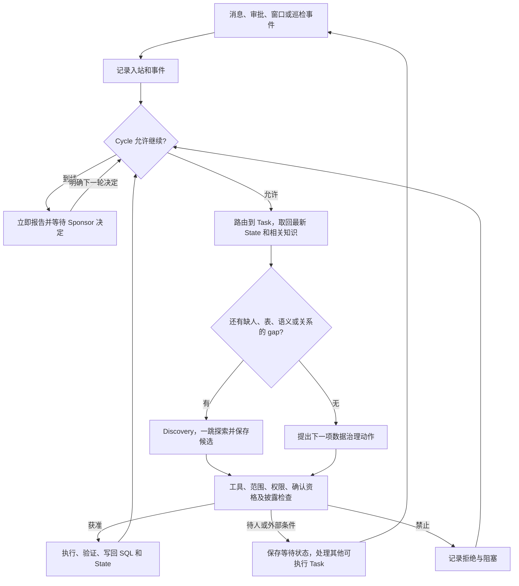

# 1 项目总括机制

2026-09-14：本版已同步用户的 [R01—R16 最终决定](2_实现方法_checklist.md#review)，[决定原文](素材/机制最终决定原文.txt)优先于早期讨论；这里描述目标机制，不代表代码已经完成。

2026-09-14 二轮：走读冲突的收口结论见 [R17—R28 补充决定](2_实现方法_checklist.md#review2)，与 R01—R16 同级，冲突时以 R17—R28 为准。总原则：**Hermes 负责发现、判断、协调和推进；正式权限、确认权、执行窗口和跨域裁决必须来自独立可信的 authority / policy；所有长期事实进入 SQL/State，Memory 只做摘要和沟通辅助。**

## 产品定位与工作层级

Hermes 是运行时，本项目将它专精为持续推进企业数据治理的 Data Steward：认识相关人员，发现并接入获准的数据，理解字段与关联，处理质量问题，形成有依据、可复核、可复用的数据资产。

最终范围是数据治理。它可以在权限允许时说明数据是否具备、质量和新鲜度如何、哪些关联已确认；不直接回答“哪个客户利润最高”“销售为什么下降”、预测或投资分析等问题。早期对话用客户利润解释业务价值，后续已将执行职责收敛为“为这些分析建立可信数据基础”。

工作按四层组织：

| 层级 | 决定什么 | 变化节奏 |
|---|---|---|
| Role / Identity | 我是谁、负责什么、哪些原则始终成立 | 长期稳定 |
| Mission / North Star | 为谁建立什么可信数据基础，范围与成功方向是什么 | 项目级，低频修改 |
| Cycle / Current Objective | 这轮先解决哪个缺口、允许自主推进多久 | 每次人工 review 后调整 |
| Task / Question | 当前具体做什么、问谁什么问题、怎样算完成 | 随事件推进 |

核心产物是 Bronze、理解/画像、Silver/Reusable Lake Assets，以及持续积累的 Knowledge SQL。Gold、Mart、KPI、Dashboard、客户利润宽表和最终业务验收交下游 Analytics / BI / Data Product；Hermes 不承担最终数据产品 100% 正确性责任。Cycle 到期可以只有部分 Bronze、已确认知识与明确记录的未知/异常。

来源：[M002—M006](素材/分享对话原文.md#m002)、[M069—M076](素材/分享对话原文.md#m069)、[M164](素材/分享对话原文.md#m164)。

## 七个模块

| 模块 | 核心职责 | 交给其他模块的事 |
|---|---|---|
| 1. Cycle / Trust | 时间或 token 到线后汇报、等待人校准，逐步调整自主周期 | 每个关键动作是否允许，由模块 7 管 |
| 2. Role / Mission | 角色、North Star、Sponsor、Scope、当前目标 | 缺人、表或知识时交模块 3 |
| 3. Discovery | 围绕具体 gap，一跳一跳寻找人、资产、语义、关系和流程线索 | 接入与整理交模块 4；等待交模块 6 |
| 4. Data Steward Loop | 资产接入、入湖、画像、理解、清洗、验证、可复用 Silver | 不确定结论交模块 3 求证，授权交模块 7 |
| 5. Organizational Knowledge | 用 SQL/State 保存可查询事实和工作进度，用 Memory 辅助恢复与沟通 | 不依赖聊天摘要作审批或数据事实源 |
| 6. Resume / Coordination | Task Session、消息路由、多任务等待和恢复、升级与人力注意力管理 | 不自行授予联系人审批资格 |
| 7. Governance / Guardrails | 数据与工具权限、SQL 准入、审批人资格、收发信可见性、审计 | 业务判断由模型提出证据和人确认 |

用户已将最初 6 个模块扩为上述 7 个。Project/Asset State、Router、Reporting、Safe Profiling、Eval 都属于这些模块内部或共享基础，不再另增一级模块。来源：[M009—M019](素材/分享对话原文.md#m009)、[M075—M082](素材/分享对话原文.md#m075)。

## 模块 1：Cycle / Trust

Cycle 管整体方向校准；Approval 管具体动作许可。即使本轮还有预算，关键动作也必须经过原有 Hook 和人工审批。

每轮明确 Goal、Scope 和上轮 Review，持久化 cycle_id、start_time、time_budget、token_budget、trust_level、status、report_budget。计时按墙钟推进、等待人回复也计时，但预算以 working day / business hours 为单位，只累计企业工作日历内的时间，不用自然日；waiting task 的累计等待跨 Cycle 保留。Time Budget 或 Token Budget 先到即 Cycle Stop，并预留报告预算。报告列上一轮意见落实情况、Cycle budget/usage、已完成、新发现、Running、等待、排期、可做未做、未知/冲突/异常与下一轮建议；同时按人展示本周期完成、Pending、Queued、Blocked by。

Trust 只改变 Cycle 长度：初期 0.5—1 个 working day，之后逐步提升到 2—3、5—7 个 working day，不扩大 Tool 权限、数据权限、Scope 或审批权限。每次到线必须先报告并由 Admin/Sponsor 放行才有下一轮。Hermes 可依据方向、报告准确性、遗漏、返工和等待管理提出升降建议，由 Sponsor 明确确认；示例周期保持可配置，不自动按轮数晋级。

到线立即报告并停止新任务/分支，不等待在途动作、不等周报。已经 Running 的动作允许完成当前动作，写 State/Result 后停，不自动启动下一步；所有尚未开始的任务，包括已批准但等待夜间窗口的 copy，暂停到下一 Cycle。入站回复仍可归档，不能据此开启后续工作。

来源：[M007—M018](素材/分享对话原文.md#m007)、[M135—M136](素材/分享对话原文.md#m135)、[M159—M162](素材/分享对话原文.md#m159)。

## 模块 2：Role / Mission

稳定身份放在 Identity/System Prompt：治理职责、不猜语义、保留来源、尊重权限、何时读 State 和调用 Skill、何时找人。项目 North Star 不写死进稳定身份。

首次用 Mission Setup / Refinement Skill 与发起人逐步澄清用途、使用者、成功方向、优先事项和禁区，再确认并写入结构化 Mission State。第一次邮件只自我介绍、简述理解、问一个能启动工作的入口问题；这些信息不一次问完。Mission 允许渐进建立，但只要 consumer、success criteria、explicit exclusions 还没补齐，每个 Cycle 至少检查并补一个关键问题，最晚在进入第一版 Silver 前完成一次 Mission Refinement。

每次开启工作分支都要判断：是否服务当前 Objective、解决明确 gap、解除 blocker 或满足必要的血缘/验证依赖。潜在范围扩展由原发起人决定；在询问前，先确认发起人有权知道准备披露的信息。Scope 同意不会自动授予数据访问权。

来源：[M020—M024](素材/分享对话原文.md#m020)、[M087—M094](素材/分享对话原文.md#m087)、[M149—M154](素材/分享对话原文.md#m149)。

## 模块 3：Discovery

探索从可描述的未知开始：人、表/系统、字段语义、JOIN、数据生成流程。Role 中写入口规则，Discovery Skill 写触发条件；模型根据当前 State 识别 gap，再按最便宜、可信的下一步探索一跳。

零资产起步先找 Sponsor，取得一个 seed person 或 seed asset/system。后续沿已知联系人、职责、能力、血缘及业务线索继续：例如订单缺折扣信息，先问订单负责人，再沿对方提供的 promotion system 线索寻找。资产多时先复用已有知识和相关资产，不做无目的全公司扫描。

探索保留 lead/candidate 及技术 verified，知识支持 confirmed、unknown、conflict、exception、deprecated。技术存在性/类型/重叠率不构成业务确认。邮件回复分两条路径：**单域、单一事实、回复者 authority 已验证、无冲突**时，回复本身可直接写 confirmed；**跨域、复杂规则、多条件或存在冲突**时，先存 claim/provisional understanding，Hermes 整理为明确结构化规则后再请对应 Authority 正式确认。跨域 JOIN/mapping 由独立的 cross_domain_relationship / integration authority 确认，域内 authority 只能确认自己这侧；沉默在两条路径下都无效。形成足够信息即可返回任务，未知与阻塞如实记录。

来源：[M025—M032](素材/分享对话原文.md#m025)、[M113—M118](素材/分享对话原文.md#m113)。

## 模块 4：Data Steward Loop

每张表有 Asset State，记录身份、阶段、已知语义、未知项、候选/确认关联、质量问题、阻塞、下一步；详细知识存 SQL，状态保存引用和进度。

```text
发现 → 判断 Scope / 相关性 / 权限 → 正式获准接入 → Bronze
→ Lake 内 Safe Profiling → 结构与业务理解
→ 当前 Scope 的 Sponsor Silver 阶段门已开
→ 各 Asset / Task 按自身成熟度进入 Silver Candidate
→ transformation 验证与必要人工复核 → Silver / Reusable Lake Assets

全过程：事实、语义、关系、角色、异常与 Evidence → Knowledge SQL
下游负责：Gold / Mart / KPI / Dashboard / 最终业务分析和验收
```

知道一张表先得到线索/档案，获批复制到湖后才得到 Bronze。源端访问分两级：`metadata_visibility` 覆盖表存在、schema、类型、大小估算等最小 metadata，真正 sample、扫描与 Bronze copy 需要更高一级 `data access / ingestion approval`，低级不自动升级为高级。Sponsor 批准的是当前 Scope 可以开展 Silver 工作，不要求所有表同时升级；Scope 实质扩大才重新审批阶段门。每张表进入 Silver Candidate 前必须满足 Bronze Ready、Safe Profiling 完成、关键语义足够清楚、必要关系已确认、transformation 有依据；不成熟的表可保留证据或延期。

源端只做安全接入必须的 Metadata、Schema、数据量估算、必要主键/时间字段和基础可访问性检查，这些落在 `metadata_visibility` 级别；复制 Bronze 后深度画像、质量、关联验证和清洗在 Lake。后续只有 Freshness、Schema drift、明显复制异常才受控回源；普通同步不重复源端深度扫描。Lake 不取消敏感权限和资源限制。

大表白天取得正式批准，按 Asset Policy 或有资格的取数/System Expert 在审批时设定的 Execution Window 进入 approved_waiting_window；到窗口且 Cycle 允许才预检执行。Hermes 可以提示「可能存在源端负载风险」，但 `execution window / copy mode / load policy` 不由模型自拟，只负责遵守与调度。通知发受影响的 System/DB Owner，必要时 Data Owner，不默认 Sponsor；提前量 10m/30m/none 可配。通知不再审批，无人回复时只要 Approval/Window 有效、Pre-check 通过仍可执行；Cycle 已停的未开始任务暂停。

画像覆盖数量、类型、空值、去重、最小/最大、中位数、分位数、频率、异常类别、时间缺口、主外键候选与关系验证。负金额先问清语义，不猜测清洗。Silver 提案说明 Input/Transformation/Reason/Evidence/Expected Output。首次 transformation 或重大变化由对应 Authority 复核 Before/After、影响行数、关键字段、聚合差异、异常数和规则说明；不统一找 Sponsor。

已批准且同规则/Scope/语义的重复执行可自动质量验证。Schema、逻辑、明显分布漂移、JOIN coverage 明显变化、影响范围异常扩大或新异常类型出现时重新人工复核。规则 confirmed 不表示数据 100% 正确；Exception/Unknown/Conflict 与 Evidence 必须保留。

**每个资产第一次成功进入 Bronze，幂等登记一次 Integration Assessment，第一张表同样登记**（第一张因为没有其他资产，结论可以直接是「暂无可关联对象」，但事件必须落库）。评估与旧资产是否相关、是否要连、如何连、有无 Mapping、新业务实体以及需要谁确认；候选按任务、实体、语义和血缘筛选，不全湖暴力两两 JOIN。普通同步不重复开 Session；关键 Schema/JOIN Key/语义、Source/Lineage、Mission Scope 变化或已确认关系明显失效才重评。Cycle 已停只写 assessment_required，不启动 Session。

源表整改建议保留为低优先级发现，只有阻塞当前正确性时才提升处理优先级；不由此自动获得生产修改权。

来源：[M033—M038](素材/分享对话原文.md#m033)、[M097—M106](素材/分享对话原文.md#m097)、[M113—M134](素材/分享对话原文.md#m113)。

## 模块 5：Organizational Knowledge

| 信息 | 长期落点 | 使用原则 |
|---|---|---|
| 人、角色、职责、所有权、Authority、Visibility、字段定义、JOIN、Lineage、历史决定、异常、证据 | SQL Knowledge，通过受控 Tool 读写 | 事实源；带来源、状态、时效与适用范围 |
| 某人熟悉销售库历史、曾解决哪些问题 | SQL 的个人能力/经验记录 | 辅助寻找知情人，不自动赋予 authority |
| Project、Cycle、Asset、Task、Question、等待和 next_action | 现有 State Tool | 精确工作现状，复用现有存储基础 |
| 某人喜欢简短邮件、具体表例子 | Person Memory | 准备联系这个人时按需加载 |
| “目前连了 5 张表，正在确认退款” | Project Summary Memory | 快速恢复摘要，须服从 SQL/State |
| 当前正在讨论的话题、刚问过什么 | Task Session | 连续对话上下文，不替代长期事实 |

人物与岗位拆开，结构化能力/经验也进 SQL，例如 capability、confidence、evidence_count、source、last_verified。本人自述只记 self_claimed，转介只建立联系人关系、不建立审批资格；独立可信来源可为 OA/IAM/HRIS/Org Directory/Authority Store、Admin 显式授予的 `Person + Scope + Authority Type`、已确认 Authority 的合法转授权。Sponsor/Boss 的明确指定必须落成这种显式授予记录才生效。正式 Authority 绑定 Person + Role + Domain/Asset + Authority Type；联系人、允许来信、Visibility、语义权与审批权分别管理。

同一资产同一种 Authority Type 只有一个当前 active approver，更换用 valid_from/valid_to 表达；访问审批人与语义审批人可以不同。跨域双方分别确认的是各自范围，不把同一 Authority Type 配成多个同时有效的人。跨系统 JOIN/mapping 另设独立的 `cross_domain_relationship / integration authority`，挂在关系对象而不是单张表上，同一关系同一时间只有一个 active。

People/Roles/Capabilities/Assets/Ownership/Semantics/JOIN/Authority/Visibility/Decisions/Evidence 和 Project/Asset/Task 等事实变化即写 SQL/State。Memory 只管项目摘要、沟通偏好与跨 Session 快速恢复；Session 收尾、Cycle 收尾、重大 Mission/Objective 变化时刷新。保留冲突各方、适用范围与历史决定；confirmed 不能抹掉当前数据异常。

新 Session 先读 Memory Summary，再读相关最新 State/SQL，冲突以事实源为准并必要时重写摘要。连续 Task Session 足够时不重复加载全部 Memory；长时间恢复或跨 Task 按需补背景，实际执行前仍复查对应最新状态与权限。

来源：[M039—M052](素材/分享对话原文.md#m039)、[M165—M168](素材/分享对话原文.md#m165)。

## 模块 6：Resume / Coordination

外部仍是一个 Hermes 邮箱入口，后台从 Person Session 转为 Task Session，**不是一个 Question 一个 Session**。Task 有 Goal、Scope、Done Criteria、Related Assets、Open Questions，Question 为内部子项。一个人可参与多个 Task，一个 Task 可有多人和多个线程；跨域争议用 Resolution Task Session。

```text
邮件 → 原生 thread/问题标识匹配
→ 必要时模型拆成 Answer Units
→ Question → Task Session
→ 取回最新 State/Knowledge → 验证回复作用范围 → 推进或继续等待
```

Message Router 优先 Email thread/In-Reply-To，再 Task/Question ID，再 Person + Open Questions，最后 LLM 语义路由；默认读 Task Goal/Summary、Open Questions、最近 3 条消息及 Incoming Message，低置信再扩上下文。已有关联 Task 就路由；无 Task 但形成独立目标则建新 Task，边缘信息进 Backlog。混答可拆给多个问题/Task，Router 无权批准或确认业务结论。

Session Router 处理内部新问题：属于当前 Scope 则就地处理；超 Scope 但阻塞当前 Task 则建 dependency/child task；不阻塞则 Backlog。Child Task 不自动获得扩 Scope 权。Done Criteria 满足且没有阻塞当前使用的 unresolved blocker 即可关闭 Task，不要求所有问题和异常都解决。

等待保存等谁、等什么、原因、恢复条件和 next_action；只在 Cycle 允许时推进其他已授权 ready task。旧审批恢复先读最新 State/Scope/Asset Version，仍适用严格 replay 原批准参数；Scope 实质变化、Schema 影响动作、Source/敏感级别变化、原任务失效则重批，模型不能改旧票。已完成事项不重复执行。超时按沟通窗口提醒、找备选或沿实际 Authority 升级；Finance 三个 working day 不回找 Boss 保留为场景。

每人未解问题有硬上限，如 3；上限不是目标，答完不自动补满。发问分两类：为关闭当前 question/task 所必需的 clarification 可以立即追问；新主题、新 Task、新问题必须进入下一批窗口。每批发问等待默认处理窗口，如 2–3 个 working day，窗口结束才发下一批/reminder/escalation；窗口、催办与 escalation 一律按企业工作日历计算。只有严重阻塞或 Sponsor/Boss 明确催办才提前追加新主题，仍受硬上限与 Cycle 约束。状态与配额按真人/Question 关联；周报显性列完成、Pending、Queued、Blocked by。首封轻量，转介时分别回原介绍人并联系新人。

多人讨论默认静默记录。Response Policy 有 SILENT、INTERVENE、WAIT_AND_SUMMARIZE：仅跑偏、关键冲突、缺 Authority、超时、已形成结论需总结确认时发言；可经配置的静默窗口合并总结。每封入站不等于每封回复；Hermes 整理明确规则后还须 Authority 正式确认，沉默不算确认。

来源：[M053—M066](素材/分享对话原文.md#m053)、[M109—M110](素材/分享对话原文.md#m109)、[M121—M132](素材/分享对话原文.md#m121)、[M169—M170](素材/分享对话原文.md#m169)。

## 模块 7：Governance / Guardrails

所有模块共享同一执行边界。模型可以判断相关性、提出候选、生成邮件和规则；能否执行、能否确认、能否披露，必须有确定性校验与审计。

| 检查 | 核心问题 |
|---|---|
| Subject Visibility | 请求者、每个收件人能否知道表存在、表名、schema、质量摘要、样本、聚合或原始值？ |
| Authority Resolution | 接入、字段语义、JOIN、transformation 等，应由哪个对应 Authority 确认？ |
| Responder Authority | 回信或点击的人现在是否具备对这个具体对象、动作和范围的资格？ |
| 执行限制 | 工具、数据范围、SQL、敏感列、扫描/返回量、超时、执行窗口是否允许？窗口由有资格的人设定，不由模型自拟 |
| 知识写入 | 证据和资格是否足以升级 confirmed？是否保留旧结论及适用范围？ |
| 对外沟通 | 是否可联系此人、可共享哪些内容、是否超出提问负担或代表组织作了承诺？ |

Lake 内 Hermes 能读什么由系统权限决定；源端读取按 `metadata_visibility` 与 `data access / ingestion approval` 两级判定；对外披露还须检查每个接收者能否知道存在性、字段、统计或原值。Visibility 未知时查已有 Authority，再找其上级/Domain Admin/HR Admin 等独立来源确认，不能让本人自证。原 Sponsor 决定 Scope 扩张，但提问前也须确认 Sponsor 可见范围；不借此泄露敏感资产。具体执行继续认正式 Approval Event，模型不得自批。

组织目录抽象提供人员、岗位、在职状态、manager、正式角色、权限与审批入口。真实企业可接 OA/HRIS/IAM；Demo 只需受控的模拟目录，重点演示资格查验，不要求现在接真实 OA。

来源：[M067—M076](素材/分享对话原文.md#m067)、[M139—M154](素材/分享对话原文.md#m139)。

## 合起来的一次工作循环



图中表示职责连接，不是替换 Hermes 的第二套 agent loop，也不表示邮件正文能直接完成审批。图中的 Running 动作收尾不阻塞到线报告；未开始任务暂停，完成事件只落 State/Result。具体实施见[已定机制与 checklist](2_实现方法_checklist.md)，走读冲突的收口见 [R17—R28](2_实现方法_checklist.md#review2)。
